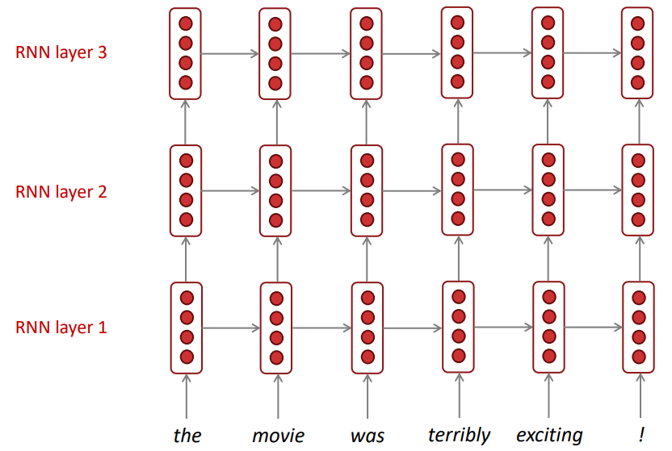

# _Bidirectional & Multi-layer_ RNNs

_Bidirectional_ RNNs (BRNNs)são uma arquitetura que utilizam de duas RNNs independentes que
processam a mesma sequência, porém, uma delas processa essa sequência no sentido convencional
(_forward RNN_) - do início para o fim - e a outra processa no sentido contrário (_backward RNN_) - do
final para o início. As saídas dessas redes, no final do processamento, em geral, são concatenadas para
cada período de tempo. Na Figura 73 abaixo, está representada uma generalização da arquitetura
de uma BRNN.

  

Figura 73: Representação de uma BRNN. Percebe-se que existem duas RNNs processando, independentemente duas
informações da mesma sequência de entrada em sentidos opostos.

BRNNs são muito poderosas para classificações de sentimento, pois conseguem compreender o
contexto das frases extremamente bem.

_Multi-layer_ RNNs são uma arquitetura que possuem diversas camadas de RNNs empilhadas processando
a mesma informação. Esse tipo de arquitetura é muito poderosa, porém o custo computacional
para o processamento das informações é muito alto. São frequentemente usadas para problemas de
tradução de máquina. A Figura 74 abaixo exemplifica esse tipo de arquitetura.

  

Figura 74: Exemplificação de uma arquitetura <i>Multi-layer</i> RNN.

