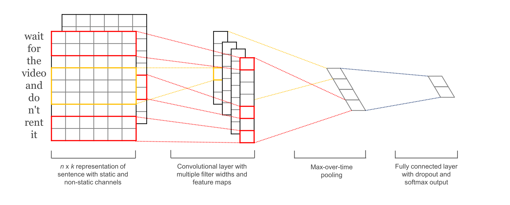

# Redes neurais convolucionais para NLP

Como foi visto na Seção [Redes neurais convolucionais (_Convolutional neural networks_)](../1/6-1.md),
CNNs conseguem paralelizar atividades devido às camadas de convolução
que atuam como cópias de um mesmo neurônio trabalhando em paralelo. CNNs
([Redes neurais convolucionais (_Convolutional neural networks_)](../1/6-1.md)) podem
ajudar a resolver esse problema.

No caso das CNNs, quando utilizadas para realização de problemas que envolvem sequências de
palavras, por exemplo, as entradas são palavras representadas por vetores de tamanho \\( k \\), e logo
após, um filtro de convolução é aplicado a fim de gerar novos valores a essas palavras. Para cada um
dos vetores gerados, escolhe-se o maior valor de cada vetor, a fim de aplicar o _pooling_. Na última
camada, aplica-se a função de ativação nos resultados (ver Figura 79).

  

Figura 79: Representação de uma CNN voltada para a classificação de sentimento de uma sentença.

A razão pela qual uma CNN pode funcionar em paralelo é que cada palavra de entrada pode ser
processada ao mesmo tempo e não depende necessariamente da palavra anterior já estar traduzida.
Além disso, a distância entre o _output_ e cada _input_ de uma CNN está na ordem de \\( log(N) \\), o que
é muito melhor que uma RNN cuja distância está na ordem linear \\( N \\).

Com isso, seria interessante se pudéssemos realizar tarefas de forma paralela como as CNNs realizam
juntamente com a efetividade da compreensão semântica do mecanismo de _attention_. Com base
nisso, uma nova arquitetura foi desenvolvida chamada _transformers_ que será detalhada na seção
seguinte.
