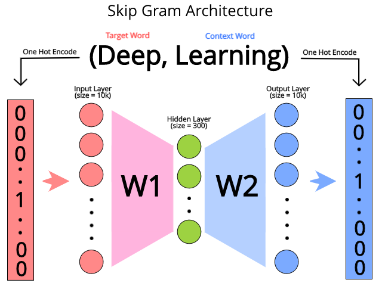

# Word2Vec

Em word2Vec, existem dois tipos de arquiteturas: _Continuous Bag Of Words_ (CBOW) e _Skip Gram_.
Primeiro iremos discutir a arquitetura Skip Gram para depois discutirmos CBOW.

Iremos fazer com que os dados nos digam quais palavras estão ocorrendo próximo de uma outra
palavra. Usamos um método chamado ”janela de contexto” para nos dizer isso.

Se utilizarmos como exemplo a seguinte frase ”Deep Learning is very hard and fun”. Primeiro devemos
definir o tamanho da janela (_window size_), que pode ser, por exemplo igual a 2. Precisamos iterar
sobre todas as palavras presentes nos nossos dados - nesse caso é apenas uma frase. Como o tamanho
da janela é dois iremos considerar duas palavras antes e duas palavras depois da palavra que estamos
analisando, como percebe-se na Figura 62. E iremos repetir isso até que todas as palavras sejam
coletadas em forma de pares.

  

Figura 62: Representação da formação de uma ”janela de contexto”.

Com isso feito, podemos formar pares entre as palavras dos dados verificados de forma que a palavra
que estamos verificando esteja relacionada com uma palavra que pertence ao contexto dela, ou seja,
buscaremos pares ordenados do tipo (target word, context word). Para a frase do exemplo teremos
os seguintes pares.

1. (Deep, Learning), (Deep, is)

2. (Learning, Deep), (Learning, is), (Learning, very)

3. (is, Deep), (is, Learning), (is, very), (is, hard)

4. (very, learning), (very, is), (very, hard), (very, and)

5. (hard, is), (hard, very), (hard, and), (hard, fun)

6. (and, very), (and, hard), (and, fun)

7. (fun, hard), (fun, and)

Esses dados podem ser considerados os nossos dados de treino para _word2Vec_.

O modelo _Skip Gram_ tenta prever o contexto de cada palavra dada uma palavra que irá ser focada.
Usamos uma rede neural para a previsão dessa tarefa. A entrada da rede neural será a versão
codificada _one-hot_ das palavras, onde o tamanho \\( V \\) do vetor será o tamanho do vocabulário. A
arquitetura da rede está exemplificada na Figura 63, abaixo.

  

Figura 63: Representação de uma rede neural para a codificação Skip Gram a partir da entrada (Deep, Learning),
onde ”Deep” é a <i>target word</i> e ”Learning” é a <i>context word</i>. A partir da target word, treinamos a rede
neural para prever a <i>context word</i>, sendo que a saída e a entrada da rede estão na forma <i>one-hot encoding</i>.

Para CBOW, a única diferença é que nós tentamos prever a _target word_ dada a _context word_,
então, basicamente, invertemos o modelo _Skip Gram_ para gerarmos o modelo CBOW, como está
representado na Figura 64.

  

Figura 64: Representação de uma rede neural para a codificação CBOW a partir da entrada (Deep, Learning), onde
”Deep” é a <i>target word</i> e ”Learning” é a <i>context word</i>. A partir da <i>context word</i>,
treinamos a rede neural para prever a <i>target word</i>, sendo que a saída e a entrada da rede estão
na forma <i>one-hot encoding</i>.

