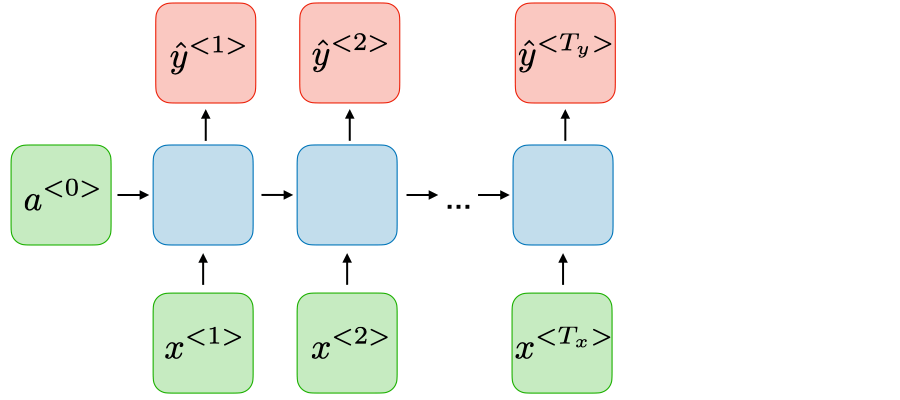
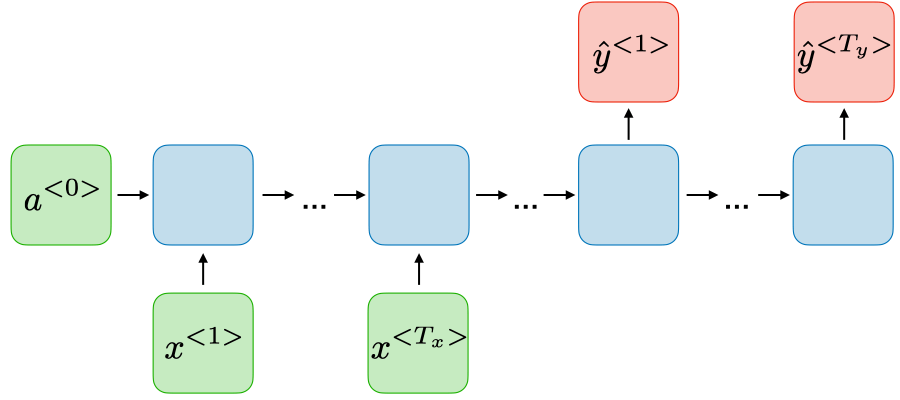

# _Many-to-many_

O tipo de RNN _many-to-many_ é uma rede neural, na qual \\( T _x = T _y \\). Esse tipo de RNN é muito
utilizada em nome de reconhecimento de entidade.

  

Figura 69: Representação de uma RNN do tipo <i>many-to-many</i> com saídas e entradas em números iguais.

A outra forma de representação desse tipo de RNN é na forma \\( T _x \neq T _y \\), também chamada de
_sequence-to-sequence_, que é realiza a codificação da entrada usando a arquitetura _many-to-one_ e a
produção da saída realizada por uma única entrada do tipo one-to-many, como se pode perceber na
Figura 70. Esse tipo de RNN é muito utilizada em tradução de máquina.

  

Figura 70: Representação de uma RNN do tipo <i>many-to-many</i> com saídas e entradas em números diferentes.

