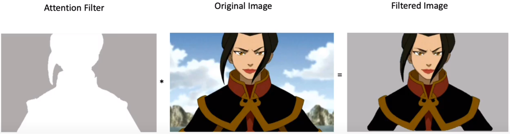

# _Self-Attention_

Segundo a definição de Ashish Vaswani et al. [[21]](../../referencias.md) do Google Brain, "_Self-attention_,
às vezes chamado de _intra-attention_, é um mecanismo de atenção relacionado a diferentes posições de uma única
sequência que tem como objetivo computar uma representação para a sequência".

_Self-attention_ nos possibilita encontra correlações entre diferentes palavras de entrada indicando a
estrutura contextual e sintática da sentença.

Na prática, o _transformer_ possui três representações de _attention_ formadas por matrizes denominadas
_Queries_, _Keys_ e _Values_ resultantes da camada de _embedding_. Essa representação é chamada de
_Multi-head attention_ (Figura 83).

  

Figura 83: Representação de <i>multi-head attention</i> em um <i>transformer</i>. Os símbolos Q, K e V representam,
respectivamente as matrizes <i>Queries</i>, <i>Keys</i> e <i>Values</i>.

O princípio básico da criação dessa camada é o descobrimento de relações semânticas nas sentenças.
Após a camada de _embedding_, os vetores expressam a relação entre cada uma das palavras e, a
partir desse contexto, a camada de _multi-head attention_ tem como objetivo relacionar a palavra
que estamos buscando (Q) com as palavras que possam estar relacionadas com ela (K) e, por fim,
influenciar a decisão de acordo com a palavra que gostaríamos que fosse retornada (V).

Essas matrizes, inicialmente, são todas iguais quando passadas como entrada para a _linear layer_ (por
isso o nome _self-attention_). Essa _linear layer_, tem como objetivo diferenciar cada uma dessas três
matrizes Q, K e V multiplicando cada uma delas por três matrizes de pesos da distintos
\\( W _Q , W _K , W _V \\), um para cada uma das *linear layers*.

Para comparar a palavra que estamos buscando Q com os seus possíveis relacionamentos K, reali-
zamos uma operação vetorial que calcula o cosseno do ângulo entre essas palavras. Esse ângulo,
como vimos na [Vetores de palavras (_word embeddings_)](../2/6-2-2.md) representa o quão relacionadas
semanticamente essas palavras estão. Genericamente, o cálculo do cosseno entre dois vetores se dá por

\\[
  \large{} \cos (A,B) = \frac{A \cdot B}{|A| |B|}
\\]

Com isso em mente, a primeira tarefa que devemos realizar é encontrar os relacionamentos entre
as matrizes Q e K. Para isso realizamos o produto entre essas matrizes (numerador da equação
acima) a fim de gerar um filtro de atenção e dividimos pela raiz quadrada tamanho da sentença
\\( \sqrt{d _k} \\) (denominador da equação acima). Por fim, os resultados dessa matriz é passado para uma camada
de ativação _softmax_ (Seção [Camada de ativação: Hyperbolic tangent](../../parte-3/2/3-2-1-6.md)) a fim de
gerar valores de probabilidade dos relacionamentos entre as palavras. Essas operações irão gerar um filtro
de atenção que irá prestar atenção em uma parte específica da sentença baseando-se no relacionamento entre
cada uma das palavras.

Para facilitar a compreensão, podemos fazer um paralelo com a atuação de um filtro de atenção
sobre uma imagem. O que acontece, neste caso é que ignoramos todos os pixels da imagem original
que não interferem no resultado que desejamos alcançar. A Figura 84 abaixo, representa a aplicação
do filtro de atenção gerado sobre uma imagem original. O resultado dessa aplicação é uma imagem
em que somente o que realmente interessa está aparecendo.

  

Figura 84: Exemplificação da aplicação de um filtro de atenção sobre os valores dos pixels de uma imagem.

Nesse sentido, de acordo com a imagem acima, _attention filter_ é o filtro gerado através das multi-
plicações de matrizes, escalonamento e _softmax_ realizadas com as matrizes Q e V e _original image_
é a entrada do mecanismo de _self-attention_, ou seja, a matriz V. Portanto, para a gerar a imagem
filtrada, realizamos, basicamente, uma multiplicação entre o filtro de atenção gerado pelas matrizes
Q e K e o conteúdo de entrada V.

Com isso, temos, finalmente, a equação desse mecanismo de _self-attention_, descrita abaixo.

---

\\[
  \large{} Attention (Q,K,V) = softmax \Big( \frac{QK ^T}{\sqrt{d _k}} \Big) V
\\]

---
