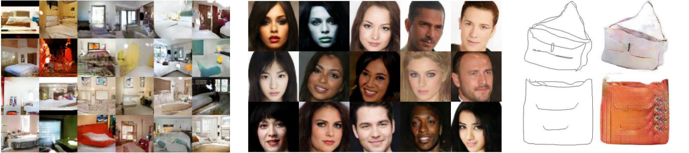

# Aplicações

Com modelos generativos podemos criar amostras extremamente realistas como por exemplo modelos
de arte, imagens, tarefas como _super-resolution_ e colorização.

  

Figura 88: Exemplos de modelos generativos. Na primeira imagem estão representados modelos de arte gerados a
partir de ambientes. Na segunda imagem estão representadas imagens em alta resolução geradas a partir de
identificação de rostos. Na terceira imagem estão representados exemplos de colorização de imagens a partir de uma
”croqui” e imagens de treino.

Além disso, modelos generativos podem ser aplicados em outras áreas de _unsupervised learning_, como
por exemplo simulações e planejamentos usando _reinforcement learning_.

Com isso, temos três formas de modelarmos esse tipo de distribuição de modelos generativos: através
de _Auto-regressive Models_, _Auto-encoders_ e GANs. Iremos discutir, separadamente, nas seções
seguintes modelos como PixelRNN, PixelCNN, _Variational Autoencoder_ e GANs.
