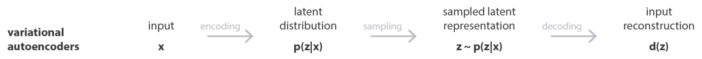

# _Variational Autoencoders_ (VAE)

Como vimos até agora, PixelCNNs definem a função de densidade travável e otimiza a probabilidade
de dados de treinamento. De outra forma, VAEs definem funções de probabilidade intratáveis de
acordo com um valor \\( z \\) que é chamado de espaço latente e será definido posteriormente.

Dessa forma, um VAE é um _Autoencoder_ cuja distribuição de codificações é regularizada durante
o treinamento, a fim de garantir que seu espaço latente tenha boas propriedade, o que nos permite
gerar novos dados

Em geral, _Autoencoders_ são redes neurais para redução de dimensionalidade. A estrutura básica de
um _Autoencoder_ está representada na Figura 91 Essas redes neurais tem como objetivo aprender o
melhor esquema de codificação-decodificação usando um processo de otimização iterativo.

  

Figura 91: Através de dados de entrada <b>x</b> treinamos o nosso modelo de forma que possamos reconstruir os dados
originais através do <i>Autoencoder</i>. Dessa forma, <b>z</b> são os dados de entrada codificados através de algoritmos de
redução de dimensionalidade e <b>x̂</b> é o conjunto de dados decodificado a partir de <b>z</b>.

Assim, a arquitetura geral de um _Autoencoder_ cria um gargalo de dados que garante que apenas a
parte estruturada principal da informação possa ser reconstruída. Os codificadores e decodificadores
são transformações lineares simples que podem ser expressas como matrizes, da mesma forma que o
algoritmo PCA funciona e no final, adicionamos não-linearidade.

_Autoencoders_ são, portanto, arquiteturas de codificador-decodificador que podem ser treinadas uti-
lizando um algoritmo de otimização como, por exemplo, gradiente descendente.

Finalmente, podemos definir um VAE. VAE é uma arquitetura composta por um codificador e um
decodificador treinada para minimizar o erro de reconstrução entre os dados decodificados e os dados
iniciais. Assim, podemos treinar o modelo da seguinte forma:

1. A entrada é codificada como distribuição do espaço latente \\( z \\)

2. Um ponto do espaço latente é amostrado a partir dessa distribuição

3. O ponto amostrado é decodificado e o erro de reconstrução pode ser calculado

4. _Backpropagation_ utilizando o erro de reconstrução

Na Figura 92 a seguir, está esquematizado o processo de treino do modelo, sabendo que \\( x \\) representa
os dados de entrada, \\( z \\) o espaço latente e \\( d(z) \\) a reconstrução da entrada.

  

Figura 92

Com isso, a função custo que é minimizada ao treinar um VAE é composta por um ”termo de
reconstrução” que torna o esquema de codificação-decodificação mais eficiente e um ”termo de re-
gularização” que regulariza a organização do espaço latente, tornando-a mais próxima da Distribuição
Normal Padrão. Esse termo é expresso como a divergência de Kullback-Leibler, que sua definição
não faz parte do escopo deste curso.

A seguir, na Figura 93 está esquematizada uma estrutura básica de um VAE com a definição da
sua função custo, que são dependentes dos valores de entrada \\( x \\), da distribuição do espaço latente
\\( N(\mu _x , \sigma _x ^2) \\) e da aproximação gerada a partir do espaço latente \\( x̂ = d(z) \\).

  

Figura 93

Portanto, através de VAEs podemos utilizar amostras usadas no espaço latente para gerar dados
similares através do decodificador. A figura abaixo mostra os dados gerados a partir de uma rede
decodificadora de um VAE treinada a partir da base de dados MNIST. Além disso, um dos pontos
negativos da utilização de VAEs é que as amostras geradas são embaçadas e de baixa qualidade.
Portanto para a melhoria da qualidade utilizamos GANs, que serão descritas a seguir.

  

Figura 94: Nesta imagem estão representados os dígitos gerados por uma rede VAE através do decodificador. A
imagem tem esse padrão devido a forma bidimensional da Distribuição Normal. Como se pode perceber, os dígitos
distintos estão em diferentes regiões da imagem devido ao espaço latente.

