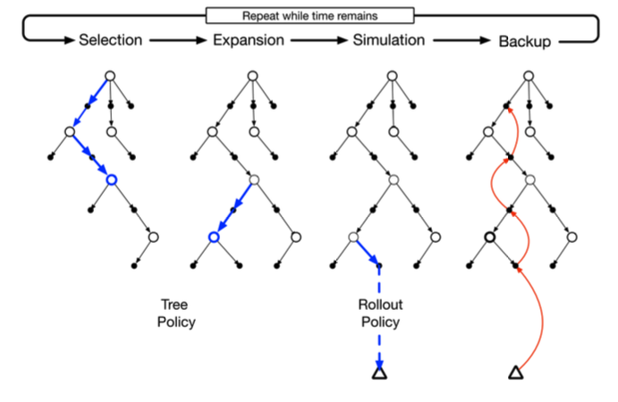

# Monte Carlo *Tree Search*

MCTS é um método de busca baseado no método de *uninformed search*, porém, mais inteligente.
MCTS usa simulação de Monte Carlo [[17]](../../referencias.md) para acumular estimativas de valor para orientar em qual
direção ou trajetória da árvore devemos seguir para maximizar a recompensa na árvore de busca. Em
outras palavras, MCTS presta mais atenção em nodos que são mais promissores, fazendo não seja
necessário acessar todos os nodos da árvore para valorar um estado.

Basicamente, esse método consiste em quatro etapas bem separadas: seleção, expansão, simulação
e *backup*.

No passo de simulação, utilizamos *tree policy* para construir um caminho da raiz até o nodo folha
mais promissor. *Tree policy* é utilizada para selecionar a melhor ação a partir de um estado. No
AlphaGo, o cálculo dessa política se dá através do valor UCB, que calcula o grau de confiança de
uma determinada ação ser a mais promissora. Abaixo está representado o cálculo desse valor.

\\[
  \large{} UCB (node _i) = V _i + 2 \sqrt{ \frac{\ln N}{n _i} }
\\]

onde, \\( V _i \\) é a média de recompensa de todos os valores abaixo de \\( node _i \\). \\( N \\) é o número de vezes que
o pai de \\( node _i \\) foi visitado e \\( n _i \\) é o número de vezes que \\( node _i \\) foi visitado.

Com isso, percebe-se que quanto mais um nodo \\( i \\) é visitado, menor é o valor UCB, diminuindo
a probabilidade desse nodo ser selecionado novamente. Assim, usa-se técnicas de _exploration_ e
_exploitation_, vistas na Seção [Aprendizado por reforço (_Reinforcement learning_)](../../parte-4/4/4-4.md)
para a valoração dos estados através do valor UCB.

Na etapa de expansão, apenas selecionamos um nodo de forma aleatória para ser explorado.

Na etapa de simulação, simulamos uma ou mais jogadas para verificar a recompensa acumulada
de cada ação. Por exemplo, para cada simulação teríamos valores acumulados referentes à vitória,
derrota ou empate.

Na etapa de _backup_ usamos os valores de recompensa acumulados das ações tomadas e estados atingidos na etapa de
simulação, propagando esses valores em direção ao nodo raiz a fim de possibilitar
a realização da melhor transição de estado.

A Figura 101 abaixo exemplifica de forma conjunta cada uma dessas etapas.

  

  Figura 101: Exemplificação das etapas de seleção, expansão, simulação e backup

Com isso, percebe-se que MCTS é uma ferramenta extremamente poderosa, especialmente quando
utilizada juntamente com métodos como DQN. MCTS valora as recompensas de cada estado sem
necessariamente percorrer toda a árvore para decidir a melhor jogada e DQN computa o melhor valor
Q de um determinado estado atingido por determinada ação.
